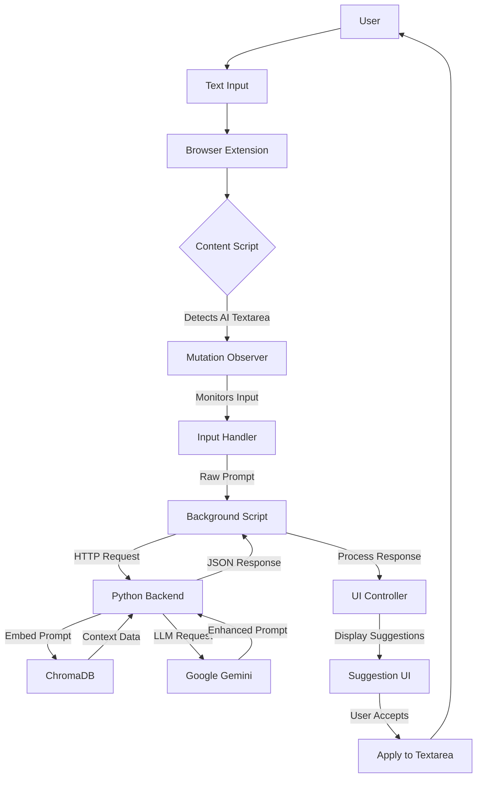

```markdown
# Prompy 🚀

**AI Prompt Optimizer with Browser Integration**  
Chrome extension + Python backend that enhances AI prompts in real-time using Google Gemini.

 *Extension → Python Backend → Google Gemini → Enhanced Prompt*

## Features ✨
- 🖥️ **Real-time Suggestions** - Grammarly-style underline for prompt improvements
- 🔄 **One-Click Apply** - Accept enhanced prompts directly in chat UIs
- 🌐 **Cross-Platform** - Works on ChatGPT, Claude, Poe, and more
- 📚 **Context Memory** - Remembers your preferences via ChromaDB
- ⚡ **Local Backend** - Python service handles prompt processing

## Tech Stack 🔧
| Component               | Technology                  |
|-------------------------|-----------------------------|
| Browser Extension       | Vanilla JavaScript          |
| Content Scripts         | MutationObserver API        |
| Backend Service         | Python + LangChain          |
| Vector Database         | ChromaDB                    |
| ML Models               | Google Gemini + Embeddings  |

## Architecture Overview


## Installation 📦

### 1. Backend Setup
```bash
git clone https://github.com/yourusername/prompy-backend
cd prompy-backend
pip install -r requirements.txt
python main.py --serve  # Starts REST API on port 8000
```

### 2. Chrome Extension
```bash
git clone https://github.com/yourusername/prompy-extension
```

1. Open `chrome://extensions`
2. Enable "Developer mode"
3. Click "Load unpacked" and select `prompy-extension` folder

### 3. Configure API Endpoint
Edit `extension/config.json`:
```json
{
  "backend_url": "http://localhost:8000/optimize"
}
```

## How It Works 🔍

### Detection Mechanism
```javascript
// content-script.js
const AI_TEXTAREA_SELECTORS = [
  '#prompt-textarea', // ChatGPT
  '.ace_content', // Claude
  '.chat-input', // Poe
];

function initObserver() {
  const observer = new MutationObserver(checkForInputs);
  observer.observe(document.body, { subtree: true, childList: true });
}

function checkForInputs() {
  AI_TEXTAREA_SELECTORS.forEach(selector => {
    const element = document.querySelector(selector);
    if (element) setupInputHandler(element);
  });
}
```

### Suggestion UI
```javascript
function showSuggestion(element, enhancedPrompt) {
  const suggestionDiv = document.createElement('div');
  suggestionDiv.className = 'prompy-suggestion';
  
  suggestionDiv.innerHTML = `
    <div class="prompy-underline"></div>
    <div class="prompy-popup">
      <p>${enhancedPrompt}</p>
      <button onclick="applySuggestion('${enhancedPrompt}')">Apply</button>
    </div>
  `;
  
  element.parentNode.insertBefore(suggestionDiv, element.nextSibling);
}
```

## Extension Manifest
```json
{
  "manifest_version": 3,
  "name": "Prompy",
  "version": "1.0",
  "permissions": ["storage", "activeTab", "scripting"],
  "host_permissions": ["*://chat.openai.com/*", "*://claude.ai/*"],
  "background": {
    "service_worker": "background.js"
  },
  "content_scripts": [{
    "matches": ["*://chat.openai.com/*", "*://claude.ai/*"],
    "js": ["content-script.js"],
    "css": ["styles.css"]
  }]
}
```

## Customization 🎨
Edit `styles.css` for UI changes:
```css
.prompy-underline {
  border-bottom: 2px dashed #4CAF50;
}

.prompy-popup {
  background: white;
  box-shadow: 0 2px 10px rgba(0,0,0,0.1);
  padding: 1rem;
  border-radius: 4px;
  margin-top: 0.5rem;
}
```

## Troubleshooting 🐞
| Issue                  | Solution                    |
|------------------------|-----------------------------|
| Suggestions not appearing | 1. Check backend is running<br>2. Verify CORS settings |
| UI glitches            | Check z-index in CSS        |
| Delay in responses     | Increase Gemini timeout     |
| Missing textareas      | Add selector to config      |

## Security 🔒
- All processing stays local (no cloud calls after initial Gemini API)
- API keys never leave the backend
- ChromaDB stores only anonymized prompt embeddings

---

**Made with ❤️ by Abhinav Raj**  
[](LICENSE)
```